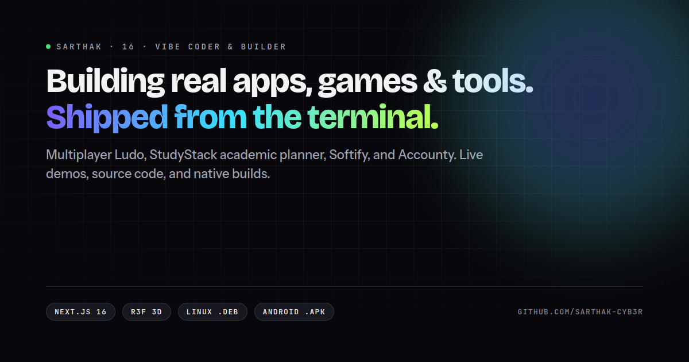

# Sarthak — Developer Portfolio & Systems Showcase



## What This Is

Production developer portfolio and engineering showcase for **Sarthak**, an independent 16-year-old software developer. Demonstrates native Android, iOS (sideload), Linux desktop, and web applications built with clean architecture, offline-first data persistence, client-side intelligence, and verified test suites.

## Live Deployment

- **Canonical URL**: [https://sarthak-cyb3r.vercel.app](https://sarthak-cyb3r.vercel.app)
- **Repository**: [https://github.com/Sarthak-Cyb3r/portfolio](https://github.com/Sarthak-Cyb3r/portfolio)

## Architecture & Tech Stack

Direct dependencies as defined in `package.json`:

- **Framework**: Next.js 16.3.8 (App Router, Server Components, Turbopack)
- **Core Library**: React 19.2.8 & React DOM 19.2.8
- **Language**: TypeScript 5.x
- **Styling**: Tailwind CSS 4.x (`@tailwindcss/postcss`) with CSS variables and custom design tokens
- **Animations & Physics**: Motion 14.0.0
- **Smooth Scrolling**: Lenis 1.3.26
- **Scroll Orchestration**: GSAP 3.15.0
- **3D Graphics**: Three.js 0.186.1 with `@react-three/fiber` 9.8.1 and `@react-three/drei` 10.7.9
- **Icons**: Lucide React 1.54.0

## Flagship Projects Featured

1. **Softify (v2.0.5)**: Cross-platform music streaming and audio engine. Built with Flutter, Drift/SQLite FTS5, and on-device ranking. Shipped on Android APK (71.2 MB), iOS IPA (11.4 MB sideload), Linux x64 `.tar.gz` (14.0 MB), and Web. 170 automated tests passing.
2. **Ludo**: Lightweight real-time multiplayer board game for 2–6 players with zero build step. Vanilla JavaScript, HTML5 Canvas, and Firestore real-time listeners. Shipped on Web, Android APK (4.5 MB), and Linux `.deb` (95 MB).
3. **StudyStack**: Unified JEE preparation analytics tracker and deterministic spaced-repetition revision engine. 455 automated tests passing.

## Scenes & Interactions Overview

- **3D Device Canvas**: Lazy-loaded React Three Fiber scene rendering interactive floating device mockups reacting to cursor orientation.
- **Scroll & Kinetic Motion**: Lenis smooth scrolling paired with scroll progress bars and section navigation telemetry.
- **Accessible Typography Reveal**: Scroll-scrubbed word-by-word reveal in the About section with natural typographic spacing and full screen-reader compliance (`aria-label` / `aria-hidden`).
- **In-Browser Terminal**: Fully interactive command console supporting real commands (`help`, `whoami`, `projects`, `skills`, `download`, `contact`, `theme`, `clear`).
- **Command Palette**: Global keyboard search modal (`Cmd+K` / `Ctrl+K`) for direct navigation.
- **Live Commit Activity**: Server-side GitHub API integration with background revalidation reflecting real repository updates without layout shift.
- **Light & Dark Theme**: Zero-flicker theme toggle persisted in `localStorage` with system preference detection.

## Project Structure

```
portfolio/
├── public/                 # Static assets, icons, screenshots, and OG images
├── src/
│   ├── app/                # Next.js App Router (pages, layout, metadata, routes)
│   │   ├── layout.tsx      # Root layout, fonts, metadataBase, canonical URL
│   │   ├── page.tsx        # Homepage composing all sections
│   │   └── projects/       # Dedicated project directory and case study routes
│   ├── components/
│   │   ├── canvas/         # Three.js / WebGL canvas components
│   │   ├── hero/           # Hero 3D centerpiece and fallbacks
│   │   ├── motion/         # Lenis, preloader, and scroll reveal components
│   │   ├── nav/            # Floating glass navbar and sheet menu
│   │   ├── projects/       # Project cards, interactive previews, diagrams
│   │   ├── sections/       # Hero, FeaturedWork, ProofStrip, Tech, Terminal, About, Contact
│   │   └── ui/             # Reusable UI primitives (Button, Chip, Card, Stat, DownloadButton)
│   ├── data/               # Single sources of truth (projects.ts, site.ts)
│   └── lib/                # Utility helpers, GitHub API client, OS detection, sound
├── next.config.ts          # 301 alias domain redirects and framework config
├── vercel.json             # Vercel edge redirects
├── package.json            # Exact dependencies and scripts
└── TODO.md                 # Unverified items and backlog tracker
```

## Getting Started

### Prerequisites

- Node.js 20.x or higher (LTS recommended)
- npm, pnpm, or yarn

### Installation

```bash
# Clone repository
git clone https://github.com/Sarthak-Cyb3r/portfolio.git
cd portfolio

# Install dependencies
npm install

# Start local development server
npm run dev
```

Open [http://localhost:3000](http://localhost:3000) to view the application.

### Production Build & Linting

```bash
# Typecheck and build static production bundle
npm run build

# Run ESLint verification
npm run lint

# Start production server
npm run start
```

## Verification & Test Counts

All statistics and download sizes are verified directly against source repositories and compiler release artifacts:

- **Total automated tests passing**: 625 (455 in StudyStack, 170 in Softify)
- **Platforms shipped**: Android, iOS (sideload), Linux, Web
- **Telemetry**: Zero tracking and 100% client-side privacy architecture

## License

MIT License. Designed and engineered by [Sarthak](https://github.com/Sarthak-Cyb3r).
